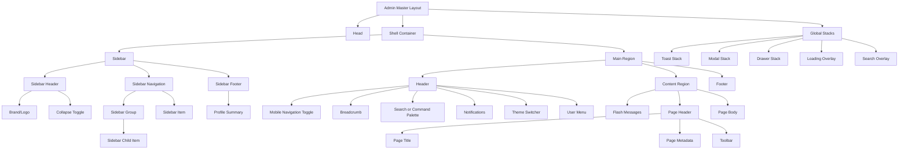

# Component Tree

## Target Tree

## Master Layout

Responsibilities:

- Own document-level structure.
- Load assets and Livewire resources.
- Provide layout context.
- Mount shell regions.
- Render global stacks.

Should not:

- Query settings directly after a layout context service exists.
- Build menus.
- Perform authorization loops.
- Contain business-specific page markup.

## Header

Required children:

| Child | Purpose |
|---|---|
| Mobile navigation toggle | Opens the drawer on small screens. |
| Search or command palette | Provides fast navigation and search. |
| Notifications | Shows count and notification menu. |
| Theme switcher | Optional user preference control. |
| User menu | Profile, settings, logout, and user actions. |

## Sidebar

Required children:

| Child | Purpose |
|---|---|
| Brand area | Logo and admin title. |
| Collapse toggle | Desktop collapse/expand and mobile close behavior. |
| Navigation list | Authorized menu tree. |
| Navigation group | Expandable parent with children. |
| Navigation item | Leaf link with icon and label. |
| Sidebar footer | Profile summary or support/version area. |

## Page Header

The page header should be available to every admin page.

Slots:

- `title`
- `subtitle`
- `breadcrumbs`
- `actions`
- `filters`
- `meta`

Rules:

- Keep H1 in the page header, not inside data cards.
- Place primary action on the right on desktop.
- Collapse actions into a menu on mobile when more than two actions exist.

## Toolbar

The toolbar is for page-level actions:

- Create.
- Export.
- Import.
- Bulk actions.
- Date filters.
- Search filters.
- View mode toggles.

It should not be used for row-level actions.

## Flash Messages

Flash messages should render above page body and below page header. Toasts are for transient feedback; flash messages are for page-level server results that must remain visible after navigation.

## Notifications

Target notification component states:

- Empty.
- Loading.
- Unread count.
- List with unread/read state.
- Mark one as read.
- Mark all as read.
- Permission denied or unavailable.

## Modal Stack

The modal stack should centralize:

- Confirmation dialogs.
- Form modals.
- Detail previews.
- Destructive action confirmations.

Modal requirements:

- Focus trap.
- Escape to close when safe.
- Focus restore.
- Label and description.
- Scroll containment.

## Drawer

Drawer targets:

- Mobile navigation.
- Import/export panel.
- Record quick edit.
- Filter panels on mobile.

Drawer requirements:

- Side placement.
- Backdrop.
- Escape close.
- Focus trap.
- Safe-area padding.

## Search Overlay

The current search is desktop-only. The target should include an overlay or command palette for mobile and keyboard use.

Expected features:

- Trigger by `Ctrl+K` or `Meta+K`.
- Search input autofocus.
- Recent destinations.
- Permission-aware results.
- Escape close.
- Empty state.

