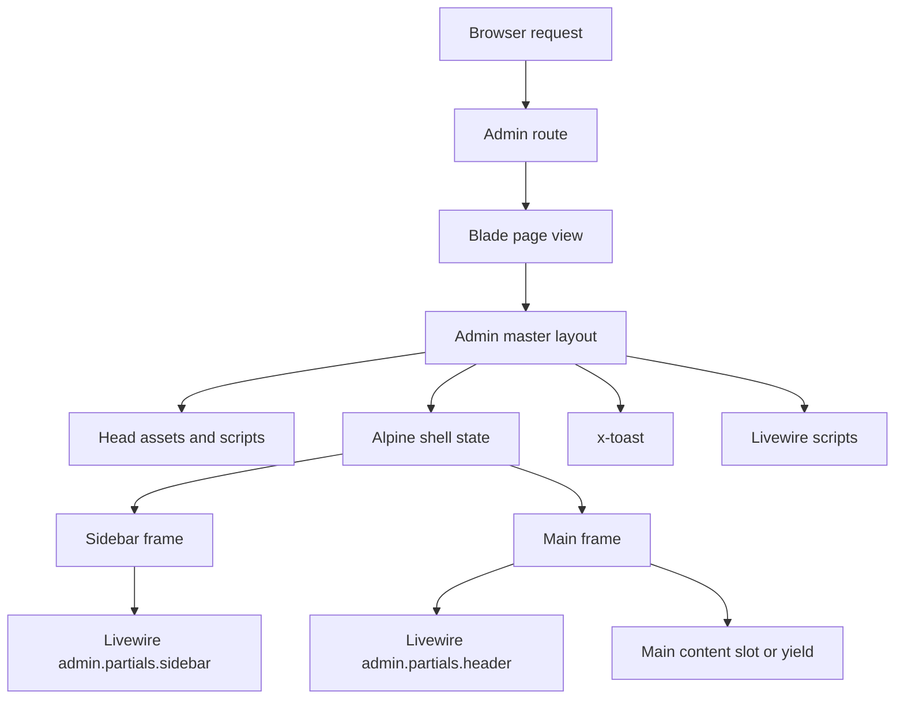
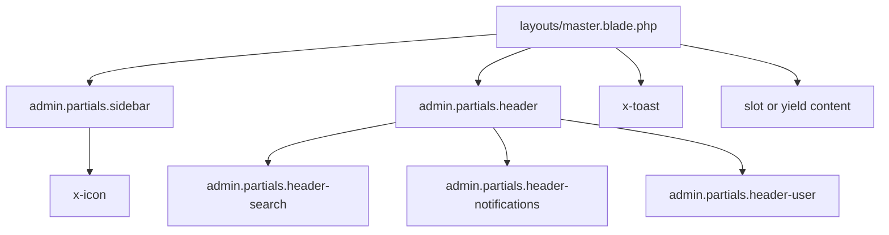
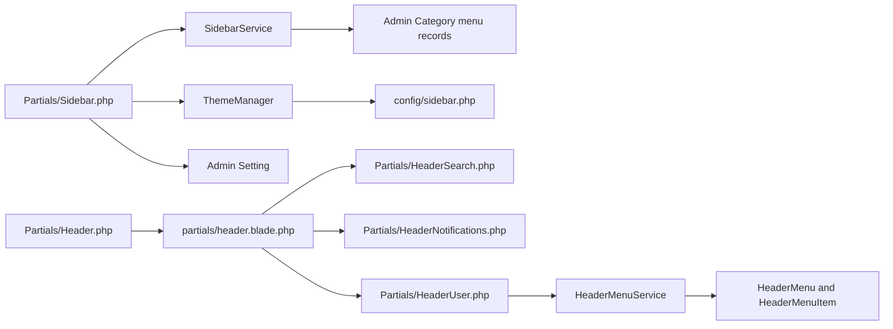

# Current Architecture

## Overview

The admin shell is composed by `Modules/Admin/resources/views/layouts/master.blade.php`. The master layout owns the document structure, asset loading, global Alpine state, sidebar frame, main content frame, Livewire scripts/styles, and toast stack.

Livewire partials provide the visible header and sidebar UI. Services provide menu and theme data.

## Page Hierarchy

## Blade Includes And Components

## Livewire Component Relationships

## Master Layout Responsibilities

| Responsibility | Current Implementation |
|---|---|
| Language | `<html lang="vi">` |
| Favicon | Reads `Setting::getValue('site_favicon')` and falls back to `/favicon.ico`. |
| Title | `@yield('title', 'HOMEPAGE')`. |
| Header script | Outputs `Setting::getValue('header_script')`. |
| Chat config | Defines `window.CHAT_CONFIG_HOST` and `window.CHAT_CONFIG_PORT` from env. |
| Assets | `@vite(['resources/css/tailwind.css', 'resources/js/tailwind.js'])`. |
| Livewire styles/scripts | `@livewireStyles` and `@livewireScripts`. |
| Sidebar state | Alpine `sidebarOpen` and `isDesktop`. |
| Content rendering | `@isset($slot)` fallback to `@yield('content')`. |
| Toast stack | `<x-toast />`. |

## Sidebar Data Flow

1. `Sidebar::mount()` receives `SidebarService` and `ThemeManager`.
2. `SidebarService::getMenus()` reads active root menu categories of type `menu`.
3. It eager loads active children and caches the result for 3600 seconds under `admin.menus`.
4. `SidebarService::buildTree()` normalizes URL values and returns arrays.
5. `Sidebar::mount()` reads `title_sidebar` from `Setting`.
6. `ThemeManager::get()` loads `Modules/Admin/config/sidebar.php`, selects a theme from session/config, and merges defaults.
7. The sidebar Blade view filters permissions, detects active routes, and renders links/groups.

## Header Data Flow

| Component | Current Data |
|---|---|
| `Header` | No state; renders the header composition view. |
| `HeaderSearch` | `public string $query`; submit redirects to `admin.search` with `q`. |
| `HeaderNotifications` | No state; renders static notification button and badge. |
| `HeaderUser` | Reads admin guard user and admin-location menu items. |

## Current State Ownership

| State | Owner | Persistence |
|---|---|---|
| Sidebar open visual state | Alpine in master layout | Browser runtime only. |
| Sidebar open Livewire state | `Sidebar::$sidebarOpen` | Session via `toggleSidebar()`, but current view toggles Alpine directly. |
| Desktop breakpoint | Alpine `window.innerWidth >= 1024` | Browser runtime only. |
| Theme name | `ThemeManager` | Session `admin_theme`, fallback config. |
| Sidebar menus | `SidebarService` | Cache key `admin.menus`. |
| Header menu items | `HeaderMenuService` | Cache key `menu_tree_{location}`. |

## Current Risks

| Risk | Why It Matters |
|---|---|
| Two sidebar state systems | Alpine and Livewire can diverge. |
| Permission checks in view | Harder to test and audit. |
| Global scripts in partials | Can duplicate under `wire:navigate` or partial refreshes. |
| Hard-coded Tailwind classes | Theme config cannot fully control UI. |
| Cache invalidation inconsistency | `Cache::flush()` is too broad for header menu reorder. |

