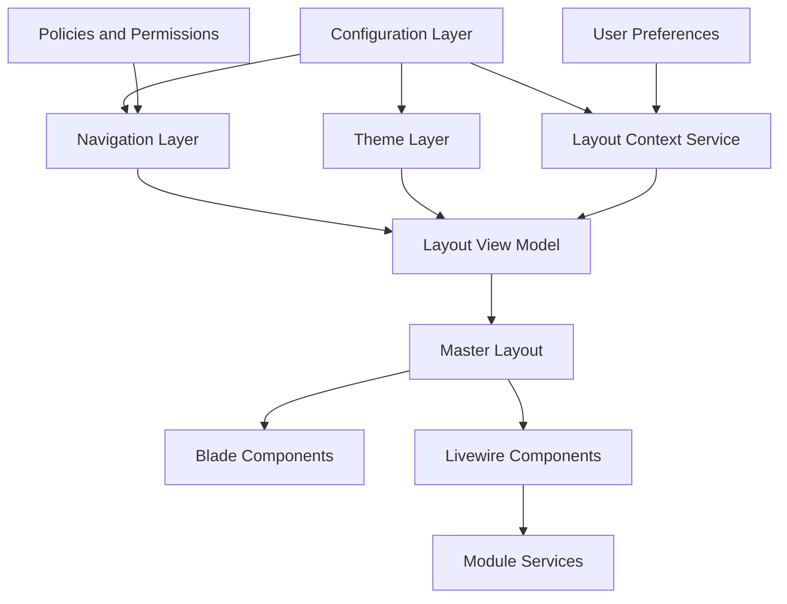
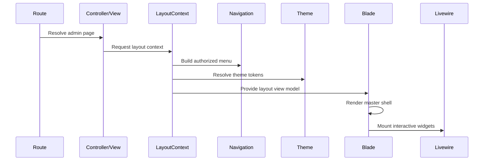

# Target Architecture

## Architecture Goal

The target admin layout should be a stable shell with clear contracts for layout composition, navigation, theme, configuration, widgets, and page chrome. Blade should render prepared view models. Livewire should own interactive server state. Alpine should own local browser-only state.

## Target Layers

## Layouts

| Layout | Purpose |
|---|---|
| `admin::layouts.master` | Full authenticated admin shell. |
| `admin::layouts.auth` | Login and password screens without sidebar/header. |
| `admin::layouts.blank` | Minimal admin pages such as print, invoice, embedded preview. |
| `admin::layouts.error` | Admin error pages with consistent branding and support actions. |

## Partials

Partials should compose large shell regions only:

- `partials/shell.blade.php`
- `partials/head.blade.php`
- `partials/sidebar.blade.php`
- `partials/header.blade.php`
- `partials/content.blade.php`
- `partials/footer.blade.php`
- `partials/stacks.blade.php`

Each partial should receive prepared data instead of querying models or settings directly.

## Blade Components

Blade components should own reusable markup:

| Component | Responsibility |
|---|---|
| `x-admin::nav.item` | Render one sidebar item with icon, label, active state, collapsed tooltip. |
| `x-admin::nav.group` | Render expandable sidebar group. |
| `x-admin::button` | Standard admin button styles. |
| `x-admin::dropdown` | Accessible dropdown shell. |
| `x-admin::page-header` | Title, breadcrumbs, toolbar, and secondary metadata. |
| `x-admin::toolbar` | Action groups and filters. |
| `x-admin::toast-stack` | Toast container and item rendering. |
| `x-admin::modal-stack` | Central modal host. |
| `x-admin::drawer` | Side drawer shell. |
| `x-admin::empty-state` | Consistent no-data state. |

## Livewire Components

Livewire should be used where server interaction is needed:

| Component | Target Responsibility |
|---|---|
| `admin.layout.sidebar` | Render menu view model, receive refresh events after menu changes. |
| `admin.layout.header-search` | Search state, suggestions, and redirect. |
| `admin.layout.notifications` | Notification count, menu, read/unread actions. |
| `admin.layout.user-menu` | User menu data and logout action if handled through Livewire. |
| `admin.layout.theme-switcher` | Theme selection and persistence. |
| `admin.layout.command-palette` | Keyboard search/action palette. |

Static composition should remain Blade-only where Livewire adds no value.

## Theme Layer

The target theme layer should expose semantic tokens, not arbitrary Tailwind fragments only.

| Token Group | Examples |
|---|---|
| Surface | `surface.base`, `surface.raised`, `surface.sidebar`, `surface.header` |
| Text | `text.primary`, `text.secondary`, `text.muted`, `text.inverse` |
| Border | `border.subtle`, `border.strong`, `border.focus` |
| Accent | `accent.bg`, `accent.text`, `accent.ring`, `accent.hover` |
| State | `success`, `warning`, `danger`, `info` |
| Density | `comfortable`, `compact`, `dense` |

`ThemeManager` may still map tokens to Tailwind classes, but views should consume named tokens consistently.

## Configuration Layer

Create a single `config/admin.php` contract for layout behavior. Existing `config/sidebar.php` can be migrated or included by this contract.

Configuration should define:

- Layout preset.
- Sidebar width and collapse behavior.
- Header height and sticky behavior.
- Container width.
- Theme and dark mode.
- Breadcrumb and footer visibility.
- Animation preference.
- Role-based layout overrides.
- User preference persistence.

## Navigation Layer

Navigation should be service-prepared before rendering.

Target responsibilities:

1. Load menu records.
2. Normalize URL and route names.
3. Apply permission pruning.
4. Calculate active/open state.
5. Attach icon metadata.
6. Attach badges when needed.
7. Return immutable arrays or DTOs for rendering.

The Blade view should not call `auth()->user()->can()` inside loops.

## Widget Layer

The layout should allow registered widgets in controlled regions:

| Region | Examples |
|---|---|
| Header left | Search, command palette trigger, breadcrumbs on compact pages. |
| Header right | Notifications, theme switcher, user menu. |
| Sidebar footer | Profile summary, version, support link. |
| Content top | Flash messages, page header, toolbar. |
| Global stacks | Toasts, modals, drawers, loading overlay. |

## Target Request Flow

